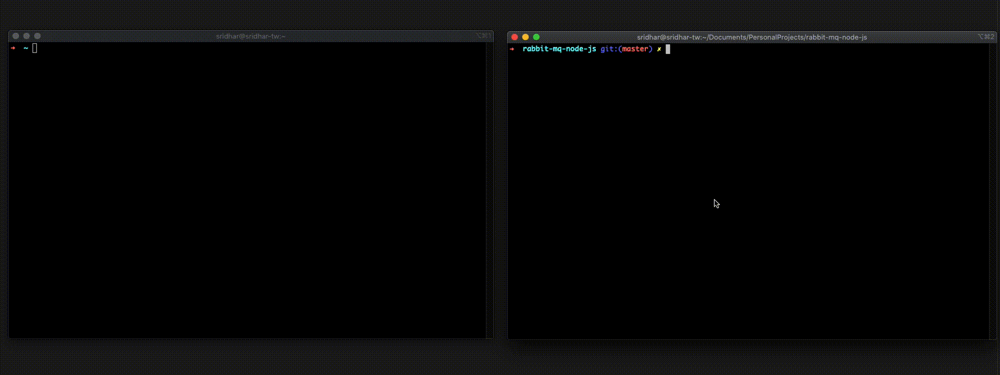

# RabbitMQ Delayed Task Execution

A sample project demonstrating how to achieve a delayed task execution using RabbitMQ deadLetterExchange and message expiration time. (No additional library is needed :)

---

## Requirements

For development, you will need Node.js, npm and RabbitMQ installed in your environement.

## Install

    $ git clone https://github.com/half-blood-prince/rabbit-mq-node-js
    $ cd rabbit-mq-node-js
    $ npm install

## Run app

Start the application server

    $ npm start

This project is configured with the 'ts-node-dev'. If you make some changes and wanted those changes apply immediately without restarting the server. Use the below command to start the application

    $ npm run dev

## Docs

Run `/api-docs` end point to get the full api documentation

Setup consumer

```
http://localhost:3000/setupConsumer/:consumerName/:queueName

where
consumerName : Name of the consumer, can be anything just to identify the consumer if you setup more than one
queueName    : The queue from which this consumer wants to listen for the messages
```

Send a delayed message

```
http://localhost:3000/sendDelayedMessage/:queueName/:message/:timeInMillis

where
queueName    : The queue to consume the delayed message
message      : Actual message payload
timeInMillis : Delay in milliseconds, after this delay the message will be delivered to the queue addressd by the queueName
```

## Demo

